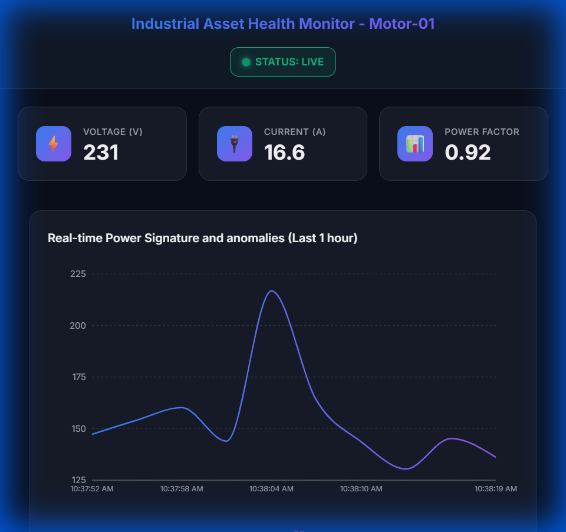
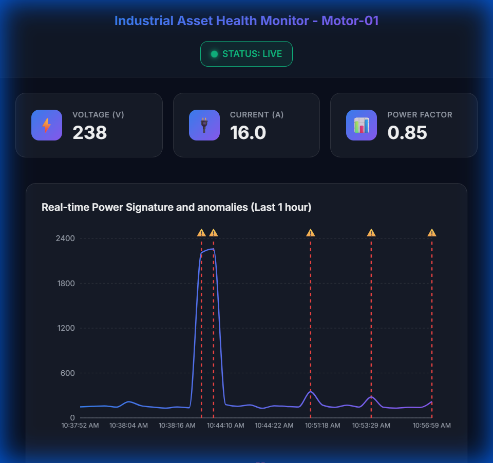
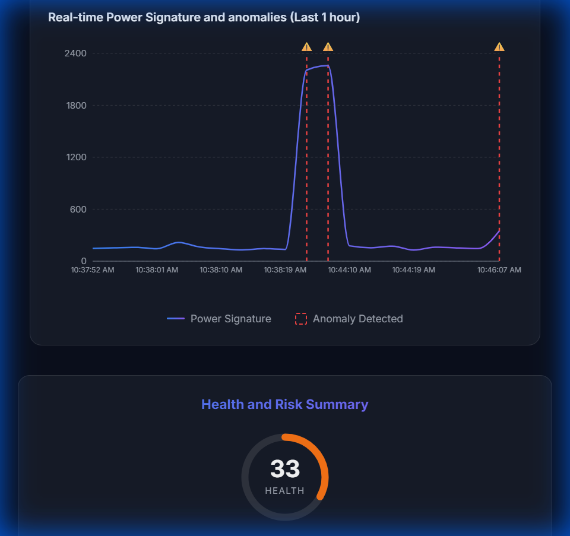
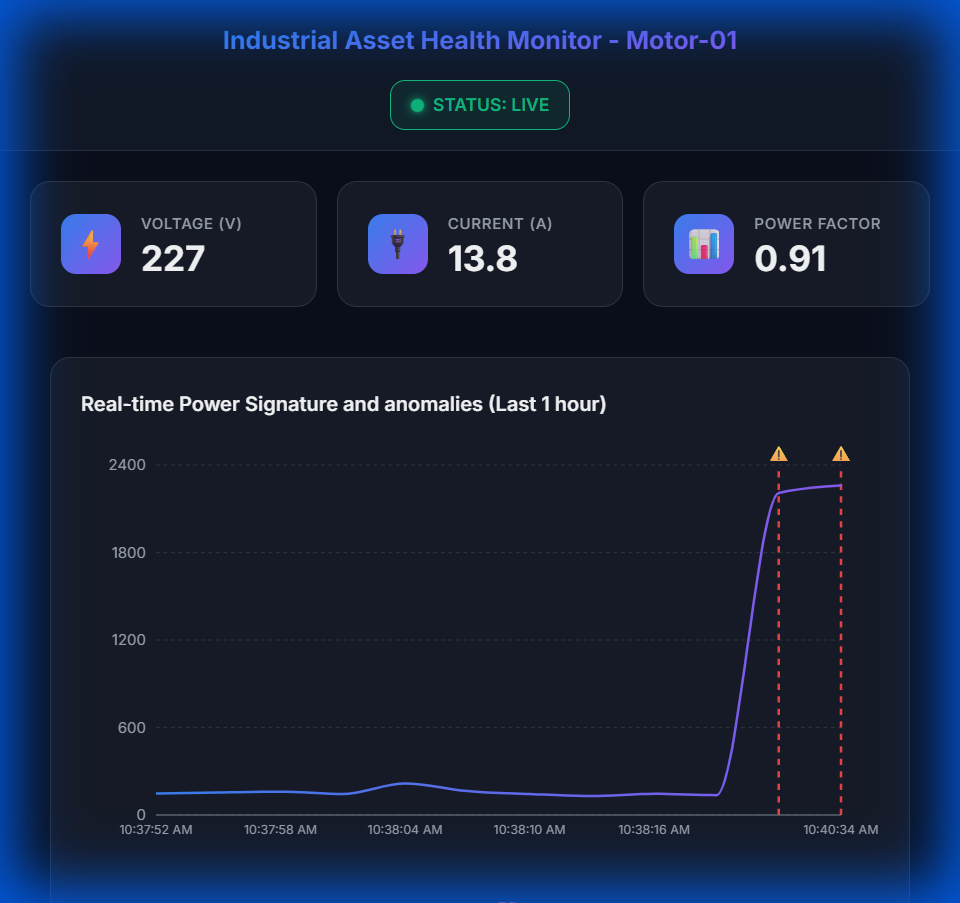

<p align="center">
  
  
  
  
  
  
  
</p>

<h1 align="center">🔧 Predictive Maintenance System</h1>

<p align="center">
  <strong>Industrial Asset Health Monitoring with ML-Powered Anomaly Detection</strong>
</p>

<p align="center">
  Real-time sensor monitoring • Dual Isolation Forest anomaly detection • 100Hz batch feature ML • Health scoring • PDF/Excel reporting
</p>

<p align="center">
  🚀 <strong><a href="https://predictive-maintenance-ten.vercel.app/">Live Demo</a></strong> &nbsp;|&nbsp;
  📄 <strong><a href="https://predictive-maintenance-uhlb.onrender.com/docs">API Documentation</a></strong> &nbsp;|&nbsp;
  ❤️ <strong><a href="https://predictive-maintenance-uhlb.onrender.com/health">Health Check</a></strong>
</p>

---

## 📋 Overview

An end-to-end **Predictive Maintenance** system that monitors industrial assets (motors, pumps, compressors) in real-time and predicts maintenance needs before failures occur.

### Key Capabilities

| Feature | Description |
|---------|-------------|
| 🔌 **Sensor Ingestion** | Real-time voltage, current, power factor, vibration data via REST API |
| 📊 **Feature Engineering** | Rolling means, spike detection, efficiency scores, RMS calculations |
| 🤖 **Anomaly Detection** | Isolation Forest model trained on healthy baseline data |
| ❤️ **Health Assessment** | 0-100 health score with risk classification (LOW → CRITICAL) |
| 🎚️ **Fault Simulation** | Configurable severity levels (MILD/MEDIUM/SEVERE) for targeted testing |
| 💡 **Explainability** | Human-readable explanations: "Vibration 3.2σ above normal" |
| 📈 **Dashboard** | React + Recharts real-time visualization with glassmorphism UI |
| 📄 **Reporting** | Role-specialized reports: Executive PDF (Plant Managers), Multi-sheet Excel (Analysts), 5-page Industrial Certificate (Engineers) |
| 📝 **Operator Logs** | Ground-truth maintenance event logging with InfluxDB persistence for supervised ML training |
| 🎯 **Baseline Benchmarking** | Live status cards display baseline target values for instant comparison |
| 🔄 **Purge & Re-Calibrate** | One-click system reset: wipes InfluxDB data + in-memory state, returns to IDLE |
| 🏓 **Keep-Alive Heartbeat** | 10-minute `/ping` heartbeat prevents Render free-tier cold starts |

---

## 🏗️ Architecture

```
┌────────────────────────────────────────────────────────────────┐
│                   Frontend (React + Vite)                      │
│                      🌐 Vercel                                 │
│  ┌──────────┐ ┌──────────┐ ┌──────────┐ ┌──────────────────┐  │
│  │ Metrics  │ │  Chart   │ │  Health  │ │  Explanations    │  │
│  │  Cards   │ │ Recharts │ │  Summary │ │     Panel        │  │
│  └──────────┘ └──────────┘ └──────────┘ └──────────────────┘  │
└────────────────────────────┬───────────────────────────────────┘
                             │ HTTPS/JSON (Vercel Rewrites)
┌────────────────────────────▼───────────────────────────────────┐
│                   Backend (FastAPI + Docker)                   │
│                      🚀 Render                                 │
│  ┌──────────────┐ ┌──────────────┐ ┌──────────────────────┐   │
│  │   Ingest     │ │   Features   │ │    ML Pipeline       │   │
│  │   /ingest    │ │   Engine     │ │  Baseline → Detector │   │
│  └──────────────┘ └──────────────┘ └──────────────────────┘   │
│  ┌──────────────┐ ┌──────────────┐ ┌──────────────────────┐   │
│  │   Health     │ │  Explainer   │ │    Report            │   │
│  │   Assessor   │ │   Engine     │ │    Generator         │   │
│  └──────────────┘ └──────────────┘ └──────────────────────┘   │
└────────────────────────────┬───────────────────────────────────┘
                             │
┌────────────────────────────▼───────────────────────────────────┐
│                 InfluxDB Cloud (Time-Series)                   │
│              sensor_data • features • anomalies                │
└────────────────────────────────────────────────────────────────┘
```

### Deployment Stack

| Component | Technology | Hosting | URL |
|-----------|------------|---------|-----|
| **Frontend** | React 18 + Vite | Vercel | [predictive-maintenance-ten.vercel.app](https://predictive-maintenance-ten.vercel.app/) |
| **Backend** | FastAPI + Docker | Render | [predictive-maintenance-uhlb.onrender.com](https://predictive-maintenance-uhlb.onrender.com) |
| **Database** | InfluxDB 2.x | InfluxDB Cloud | AWS us-east-1 |

---

## 🚀 Quick Start

### Option 1: Docker (Recommended)

```bash
# Clone the repository
git clone https://github.com/BhaveshBytess/PREDICTIVE-MAINTENANCE.git
cd PREDICTIVE-MAINTENANCE

# Start all services (backend + frontend)
docker-compose up --build

# Access the application
# Frontend: http://localhost:5173
# Backend:  http://localhost:8000
# API Docs: http://localhost:8000/docs
```

> ⚠️ **Windows Users**: Never commit `node_modules/` to Git. Windows binaries cause permission errors on Linux servers (Vercel Error 126).

### Option 2: Local Development (Manual)

#### Backend
```bash
cd backend
python -m venv venv
.\venv\Scripts\activate      # Windows
source venv/bin/activate     # Linux/Mac

pip install -r requirements.txt
uvicorn backend.api.main:app --reload
```

#### Frontend (separate terminal)
```bash
cd frontend
npm install
npm run dev
```

### Option 3: Production Deployment

See [`DEPLOY.md`](DEPLOY.md) for detailed instructions on deploying to:
- **Render** (Backend)
- **Vercel** (Frontend)
- **InfluxDB Cloud** (Database)

---

## 📁 Project Structure

```
predictive-maintenance/
├── backend/
│   ├── api/                 # FastAPI routes & schemas
│   │   ├── main.py          # Application instance
│   │   ├── routes.py        # /ingest, /health endpoints
│   │   ├── system_routes.py # Calibration, fault injection, monitoring, purge
│   │   ├── integration_routes.py # Health scoring, data history, events
│   │   ├── operator_routes.py # Operator log endpoints
│   │   ├── sandbox_routes.py  # What-If analysis
│   │   └── schemas.py       # Pydantic models
│   ├── features/            # Feature engineering
│   │   ├── calculator.py    # 1Hz rolling means, spikes, RMS
│   │   └── engine.py        # Feature extraction orchestrator
│   ├── ml/                  # Machine Learning (Dual Model)
│   │   ├── baseline.py      # Healthy data profiling
│   │   ├── detector.py      # Legacy Isolation Forest (6 features, 1Hz)
│   │   ├── batch_features.py # 16-D batch feature extraction (100Hz)
│   │   ├── batch_detector.py # Batch Isolation Forest (16 features)
│   │   └── validation.py    # 3-Sigma baseline validation
│   ├── events/              # Event Engine
│   │   └── engine.py        # State machine (HEALTHY ↔ ANOMALY_DETECTED)
│   ├── rules/               # Business logic
│   │   ├── assessor.py      # Health scoring & risk
│   │   └── explainer.py     # Human-readable explanations
│   ├── reports/             # PDF/Excel generation
│   │   ├── generator.py         # Basic PDF/Excel reports
│   │   ├── industrial_report.py # 5-page Industrial Health Certificate
│   │   ├── constants.py         # Colors, costs, thresholds
│   │   ├── mock_data.py         # Simulated historical data
│   │   └── components/          # Gauge, charts, audit components
│   └── generator/           # Digital Twin data generator
│       ├── generator.py     # 100Hz hybrid data generator
│       └── config.py        # NASA/IMS fault patterns
├── frontend/
│   ├── src/
│   │   ├── components/      # React components
│   │   │   ├── Header/
│   │   │   ├── MetricCard/
│   │   │   ├── SignalChart/
│   │   │   ├── HealthSummary/
│   │   │   ├── InsightPanel/
│   │   │   ├── OperatorLog/
│   │   │   ├── LogWatcher/      # Real-time event feed
│   │   │   ├── SystemControlPanel/
│   │   │   ├── PerformanceCard/
│   │   │   └── SandboxModal/
│   │   ├── hooks/           # usePolling
│   │   └── api/             # API client
│   └── Dockerfile           # Multi-stage nginx build
├── scripts/
│   ├── retrain_batch_model.py # Standalone batch model retraining
│   ├── setup_linux.sh       # Bare-metal Linux setup
│   └── backend.service      # Systemd unit file
├── tests/                   # 97+ unit tests
├── docker-compose.yml       # Full stack deployment
├── Dockerfile               # Backend container
└── ENGINEERING_LOG.md       # Decision journal
```

---

## 🔌 API Reference

### Ingest Sensor Data

```http
POST /ingest
Content-Type: application/json

{
  "event_id": "uuid-v4",
  "timestamp": "2026-01-12T00:00:00Z",
  "asset_id": "Motor-01",
  "sensor_data": {
    "voltage_v": 230.5,
    "current_a": 12.3,
    "power_factor": 0.92,
    "vibration_g": 0.15
  }
}
```

### Health Check

```http
GET /health

Response: { "status": "healthy", "db_connected": true }
```

### Keep-Alive Ping

```http
GET /ping

Response: { "status": "ok" }
```

> Used by the frontend's 10-minute heartbeat to keep the Render free-tier backend warm.

### System Purge

```http
POST /system/purge

Response: { "status": "purged", "message": "All data and models cleared. System reset to IDLE." }
```

> Deletes all InfluxDB data, clears in-memory baselines/detectors/history, and resets state to IDLE.

---

## 🧠 ML Pipeline

### Dual-Model Architecture

The system runs **two Isolation Forest models** trained during calibration:

| Model | Features | Input | F1 @ 0.5 | AUC-ROC | Jitter Detection |
|-------|----------|-------|----------|---------|:---:|
| **Legacy (v2)** | 6 | 1Hz averages | 78.1% | 1.000 | ❌ |
| **Batch (v3)** | 16 | 100Hz windows | **99.6%** | **1.000** | ✅ |

The batch model is primary for inference; the legacy model is retained for backward compatibility.

### Batch Feature Engineering (100:1 Reduction)

Each 1-second window of 100 raw sensor points is reduced to a 16-D statistical feature vector:

| Signal | mean | std | peak_to_peak | rms |
|--------|:---:|:---:|:---:|:---:|
| `voltage_v` | ✅ | ✅ | ✅ | ✅ |
| `current_a` | ✅ | ✅ | ✅ | ✅ |
| `power_factor` | ✅ | ✅ | ✅ | ✅ |
| `vibration_g` | ✅ | ✅ | ✅ | ✅ |

**Why it matters:** A "Jitter Fault" where average vibration is 0.15g (normal) but σ=0.17g (5x healthy) is invisible to 1Hz models. The batch model catches it because `std` and `peak_to_peak` are explicit features.

### Legacy Feature Engineering (1Hz)

| Feature | Formula | Window |
|---------|---------|--------|
| `voltage_rolling_mean_1h` | Mean of voltage over 1 hour | Past-only |
| `current_spike_count` | Points > 3σ from local mean | 10-point window |
| `power_factor_efficiency_score` | `(PF - 0.8) / 0.2 * 100` | Instantaneous |
| `vibration_intensity_rms` | √(mean(vibration²)) | Past-only |
| `voltage_stability` | `|V - 230.0|` | Instantaneous |
| `power_vibration_ratio` | `vibration / (PF + 0.01)` | Instantaneous |

### Fault Types

| Type | Description | Detectable By |
|------|-------------|---------------|
| **SPIKE** | Voltage/current surges | Both models |
| **DRIFT** | Gradual degradation | Both models |
| **JITTER** | Normal means, high variance | **Batch model only** |
| **DEFAULT** | General fault pattern | Both models |

### Health Assessment

```python
health_score = 100 * (1.0 - anomaly_score)

# Risk Classification
if health_score < 25:  risk = CRITICAL
elif health_score < 50: risk = HIGH
elif health_score < 75: risk = MODERATE
else:                   risk = LOW
```

---

## 📊 Dashboard

<p align="center">
  <strong>Dark theme with glassmorphism • Real-time charts • Color-coded risk levels</strong>
</p>

**Core Features:**
- 🟢 **STATUS: LIVE** badge with real-time connection indicator
- 📊 **Real-time Power Signature chart** with Recharts
- � **Multi-signal streaming chart** — Voltage (V), Current (A), Vibration (g) with fixed Y-axis domains and 60s right-anchored sliding window
- 🔴 **Red shaded regions** for anomaly spans (noise-suppressed: majority-rules aggregation)
- 🎯 **Health Score ring** (0-100) with color coding:
  - Green (75-100): LOW risk
  - Yellow/Orange (50-74): MODERATE risk
  - Orange (25-49): HIGH risk
  - Red (0-24): CRITICAL risk
- ⏰ **Maintenance Window estimation** (days until recommended service)
- 💡 **Insight panel** with batch-feature explanations (e.g., "High vibration variance: σ=0.17g")
- 📜 **Log Watcher** — real-time event feed with transition-based state machine events
- 📥 **Download options**: 
  - **Executive PDF** — 1-page summary with Health Grade (A/B/C/D/F) for Plant Managers
  - **Multi-sheet Excel** — Summary, Operator Logs, Raw Sensor Data for Data Analysts
  - **Industrial PDF** — 5-page technical report with Maintenance Correlation Analysis for Engineers
- 📝 **Operator Log Panel** — Real-time maintenance event logging with severity levels
- 🎯 **Baseline Target Display** — Status cards show calibrated baseline targets alongside live readings
- 🔄 **Purge & Re-Calibrate** — Purple button to wipe all data and restart calibration from scratch
- 🏓 **Keep-Alive Heartbeat** — Automatic 10-minute `/ping` to prevent Render free-tier cold starts

**Anomaly Visualization Logic:**
- Red dashed lines appear **only when risk ≠ LOW**
- When system is healthy, no anomaly markers shown

**Fault Injection Controls:**
- 🎯 **Fault Type**: Spike, Drift, Jitter, or Default patterns
- 🏚️ **Severity Levels**:
  - 🟡 **MILD** → Targets MODERATE risk (health 50-74)
  - 🟠 **MEDIUM** → Targets HIGH risk (health 25-49)
  - 🔴 **SEVERE** → Targets CRITICAL risk (health 0-24)
- **Jitter fault**: Normal means, abnormal variance — specifically tests batch model advantage

---

## ✅ E2E Verification

All risk levels have been tested with real sensor data:

| Risk Level | Health Score | Red Lines | Maintenance Window | Test Status |
|------------|--------------|-----------|-------------------|-------------|
| **LOW** | 75+ | ❌ None | ~60 days | ✅ Pass |
| **MODERATE** | 50-74 | ✅ Yes + ⚠️ | ~19 days | ✅ Pass |
| **HIGH** | 25-49 | ✅ Yes + ⚠️ | ~4 days | ✅ Pass |
| **CRITICAL** | 0-24 | ✅ Yes + ⚠️ | < 1 day | ✅ Pass |

### 📸 Demo Screenshots

<table>
<tr>
<td align="center"><strong>LOW Risk (Healthy)</strong><br>No anomaly lines</td>
<td align="center"><strong>MODERATE Risk</strong><br>Lines at anomalies</td>
</tr>
<tr>
<td></td>
<td></td>
</tr>
<tr>
<td align="center"><strong>HIGH Risk</strong><br>Multiple alerts</td>
<td align="center"><strong>CRITICAL Risk</strong><br>Immediate action needed</td>
</tr>
<tr>
<td></td>
<td></td>
</tr>
</table>

## 🧪 Testing

```bash
# Run all tests
pytest tests/ -v

# Run specific test module
pytest tests/test_features.py -v
pytest tests/test_detector.py -v
pytest tests/test_assessor.py -v
pytest tests/test_reports.py -v

# Coverage report
pytest tests/ --cov=backend --cov-report=html
```

**Test coverage by module:**

| Module | Tests | Coverage |
|--------|-------|----------|
| Feature Engineering | 20 | ✅ |
| Baseline Construction | 14 | ✅ |
| Anomaly Detection | 14 | ✅ |
| Health Assessment | 21 | ✅ |
| Explainability | 13 | ✅ |
| Reporting | 15 | ✅ |

---

## ⚙️ Configuration

### Environment Variables (Production)

**Backend** (`backend/.env`):
```env
ENVIRONMENT=production
PORT=8000
INFLUX_URL=https://us-east-1-1.aws.cloud2.influxdata.com
INFLUX_TOKEN=<your-influxdb-token>
INFLUX_ORG=<your-org-id>
INFLUX_BUCKET=sensor_data
```

**Frontend** (Vercel Dashboard or local `.env`):
```env
VITE_API_URL=https://predictive-maintenance-uhlb.onrender.com
```

### Docker Compose Services (Local Development)

| Service | Port | Description |
|---------|------|-------------|
| `backend` | 8000 | FastAPI application |
| `frontend` | 5173 | React dashboard (Vite dev server) |

All services have `restart: unless-stopped` for resilience.

---

## 📖 Engineering Decisions

Key architectural decisions are documented in [`ENGINEERING_LOG.md`](ENGINEERING_LOG.md):

- **Phase 4**: NaN for cold-start windows (prevents false zeros)
- **Phase 6**: Inverted sigmoid for anomaly score semantics
- **Phase 7**: Deterministic health formula with named thresholds
- **Phase 8**: Epsilon rule for practical significance
- **Phase 9**: Pure renderer pattern (frontend displays, backend computes)
- **Phase 10**: Snapshot rule for auditable reports; 5-page Industrial Certificate
- **Phase 11**: Dual deployment (Docker + systemd)
- **Phase 13**: Operator Log feature with InfluxDB persistence; role-specialized reports
- **Phase 14**: 100Hz high-frequency pipeline with server-side aggregation; event engine state machine
- **Phase 15**: Batch ML retraining — 16-D features from 100Hz windows; JITTER fault type; F1=99.6%
- **Phase 16**: Temporal anchoring — 60s right-anchored sliding window, fixed Y-axis domains, multi-signal chart
- **Phase 17**: Noise suppression — 25% tolerance, majority-rules aggregation (≥15/100), 2s event debounce
- **Phase 18**: Cloud recovery — lazy-loaded ML imports to prevent Render 503, `/ping` endpoint, `from __future__ import annotations` for deferred type evaluation
- **Phase 19**: Baseline benchmarking on status cards, deep system purge (`/system/purge`), report refinement (real anomaly scores, sanitized operator logs)
- **Scoring**: Batch-feature inference (primary) with legacy model fallback

---

## 🛡️ Production Deployment

### Docker
```bash
docker-compose up -d
```

### Systemd (Linux)
```bash
sudo ./scripts/setup_linux.sh
sudo systemctl status predictive-maintenance
```

**Resilience features:**
- Docker: `restart: unless-stopped`
- Systemd: `Restart=always`, `RestartSec=5`
- Health checks on all services

---

## 📜 License

This project is for educational and demonstration purposes.

---

## 🤝 Contributing

1. Fork the repository
2. Create a feature branch (`git checkout -b feature/amazing`)
3. Commit changes (`git commit -m 'feat: add amazing feature'`)
4. Push to branch (`git push origin feature/amazing`)
5. Open a Pull Request

---

<p align="center">
  <strong>Built with ❤️ for Industrial IoT</strong>
</p>